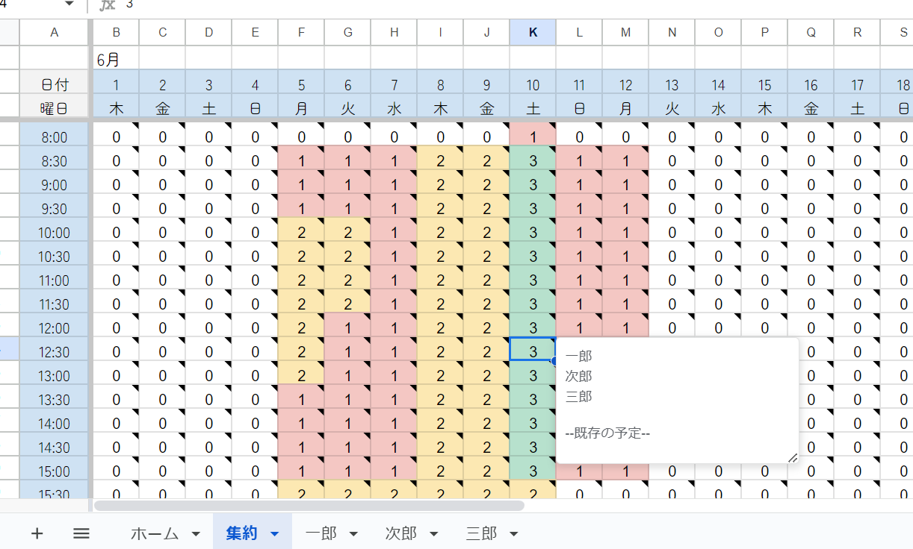
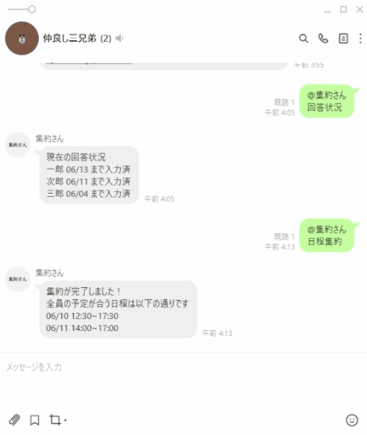
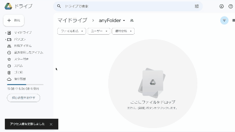
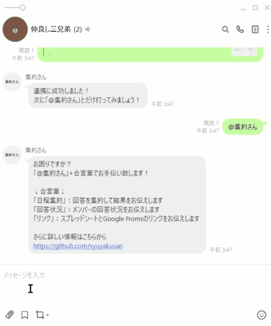
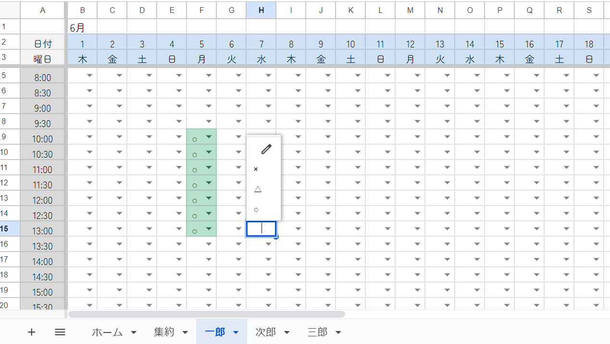

# はじめまして！集約さんです！
集約さんはGoogle SpreadSheet, Google Forms, LINEを使用した、日程集約webアプリケーションです。

# できること

- 人数が多くても、素早く・悩まず・わかりやすく日程集約を行うことが出来ます。
- 3種類のインターフェイスから、使用するデバイスに適したものを選択可能です。
    - Google Spreadsheet の編集
    - Google Forms への回答
    - LINE bot とのチャット
- 所属するグループが多くても、一括で予定を伝えることができます。(※LINE botを利用した場合)

# 概要
- **スプレッドシートが本体です**。スプレッドシートのみでの運用も可能ですが、フォームやLINE botを使用することで利便性が格段に上がります。
- グループ1つにつき専用のスプレッドシートとフォームが1つずつ作成されます。
- LINE botと連携することでLINEからスプレッドシートを操作することができます。(オプション)
    - グループトークはスプレッドシートと1対1で連携されます。複数のスプレッドシートと連携することはできません。
    - 個人トークでは複数グループのスプレッドシートと連携することができ、一度の日程回答で連携したすべてのグループに反映することができます。

# 準備

※必ずPCで行ってください

## 集約さんをインストールする

1. 集約さんを作りたいフォルダをGoogle Drive上に作り、syuyakusan@gmail.comを編集者として追加します。
2. [集約さんインストーラー](https://docs.google.com/spreadsheets/d/15q-g6N86hfvml16AOEiiuSz7uMsxZj7Px2XBHRHtYso/edit?usp=sharing)でボタンを押し、案内に従って集約さんをインストールします。承認を求められた場合は[こちらの方法](#承認が必要と表示された)で承認してください。
3. 指定したフォルダに「集約さん-ファイル名を変更してください」というファイルが作成されていれば完了です。

 

## 初期設定をする

1. 作成したスプレッドシートの「初期設定」ボタンを押して、案内に従って個人用シートと専用フォームを作成します。

## リンクを共有する

1. 「共有する」フィールドの「リンク集」のテキストをLINEグループなどに貼り付け、メンバーにスプレッドシートとフォームのリンクを共有します。
2. 必要に応じて各個人トークの連携を勧めましょう。

## LINEと連携する(オプション)

集約さんとLINEのトークを連携することで、必要な操作をスマホから手軽に行うことができます。

**※グループトークと個人トークの両方で連携する必要があります**

1. 「LINE連携」ボタンを押し、表示されたQRコードから[LINE公式アカウント](https://lin.ee/VZ6d7P8)をフォロー、集約さんを使いたいLINEグループに招待します。
2. グループトークの連携
    1. LINE botの案内に従ってスプレッドシートとグループトークを連携します。
    2. 連携に成功すると、LINE botを通じてメンバーの回答状況や日程集約ができるようになります。
3. 個人トークの連携
    1. LINE botの案内に従ってスプレッドシートと個人トークを連携します。
    2. 連携に成功すると、LINE botを通じて日程回答ができるようになります。複数のスプレッドシートを連携した場合は、日程回答がすべてのスプレッドシートに反映されます。

グループトーク/個人トークでできること
| グループトーク | 個人トーク |
| --- | --- |
| スプレッドシートの連携(1つまで) | スプレッドシートの連携(複数可) |
| 回答状況の確認 | 日程回答 |
| 日程集約 |  |

# 使い方

## 日程を回答する

### スプレッドシートから回答する

※PC推奨

1. スプレッドシートにアクセスし、自分の名前がついたシートを編集します。都合の良い時間帯の**始まりのセルから終わりのセルまでを**○にします。例えば、下の図は10:00~13:00と回答しています。オートフィルやコピペも使えるので、他のグループで回答したシートの値をコピペすることも可能です。△や×は集約結果には反映されないので入力しなくてもOK、あくまで意思表示に使います。
2. 回答したら、グループLINEなどで回答した旨を報告すると良心的です。

### フォームから回答する

1. 共有されたリンクから回答します。

※Google Formsとスプレッドシートの対応は1対1なので、複数のグループで集約さんを使っている場合はそれぞれのフォームに回答する必要があります。これに対しLINE botとスプレッドシートの対応は1対複数なので、一度に連携したすべてのグループに対して回答することができます。

### LINE botから回答する

1. 個人トークで「日程回答」を送信するか、画面下部の「日程回答」ボタン(スマホ限定)を押します。
2. LINE botの案内に従って回答します。

※ **回答は連携してあるすべてのスプレッドシートに反映されます**。スプレッドシートごとに回答を変えたい場合はフォームから回答してください。

## 回答状況を確認する

### スプレッドシートから確認する

スプレッドシート上の「回答状況を確認する」フィールドにメンバーの回答状況が表示されます。

### LINE botに聞く

グループトークでLINE botの案内に従って話しかけると、メンバーの回答状況を教えてくれます。

## 日程集約をする

### スプレッドシートから集約する

スプレッドシート上の「日程を集約する」のチェックボックスをクリックすると集約が始まります。集約結果は「集約」シートに表示されます。どの時間帯に誰がいるか、さらにGoogle カレンダー上で別の予定が入っていないかを確認することが出来ます。

### LINE botにお願いする

グループトークでLINE botの案内に従って話しかけると、日程集約を行い、全員の予定があった日時を結果を教えてくれます。その他の日時についての確認やGoogle カレンダー上の予定との比較はスプレッドシートから行って下さい。

# FAQ

## 「承認が必要」と表示された

初回実行の際には、アプリケーションが行う操作に対してGoogleアカウントから承認をする必要があります。

↓のように、「続行」→「アカウントの選択」→「詳細」→「***(安全ではないページ)に移動」→「許可」と操作して下さい。

## フォームの回答が反映されない

スプレッドシートをブラウザで開きリロードし、画面左側のステータスバーを見て処理が終わるまで待って下さい。(スプレッドシートを開くとフォームの回答を反映するスクリプトが実行されます)

## スプレッドシートの期間を変えたい(74日分以上使いたい)

集約さんを一度に連続して使用できる日数は、スプレッドシートの表示期間と一致しており、74日間です。これ以上の期間を使いたい、または過去のものを再度利用したい場合は「ホーム」シート上「開始日」のセルに新しい日付を入力し、画面上部の「期間を変更する」のチェックボックスを押して下さい。

## 使い終わったので削除したい

- スプレッドシートの「初期化」ボタンを押し初期化した上でスプレッドシートを削除してください。

※「初期化」ボタンを押さずにスプレッドシートを削除してしまった場合は、フォームの自動削除が実行されないので手動でフォームを削除してください。

- LINEグループからLINE botを削除してください。

## 初期設定をやり直したい

スプレッドシートの「初期化」ボタンを押し初期化し、初期設定をやり直してください。

## LINE botがグループに参加しない

LINEグループの「友だちをグループに自動で追加」設定をオンにしてください。オフになっているとLINE botが参加できない場合があります。

## スプレッドシートが消えた

データベースの保守管理のため、**スプレッドシートの最終閲覧日から90日以上が経過すると自動的にスプレッドシートが削除されます**。再度使用したい場合はインストールし直して下さい。

## LINE botが反応しない

- グループトークの場合はグループから削除してから再度招待、個人トークの場合はブロックしてから再度フォローをしてリセットしてください。
- スプレッドシートの設定を確認し、必要に応じて初期設定からやりなおしてください。

## 解決しない場合

お手数ですがsyuyakusan@gmail.comもしくはenohiroun1@gmail.comまでご連絡ください。

# Author&License

Copyright 2023 Hiroki Enokiya

Released under the MIT license 

https://opensource.org/license/mit/
